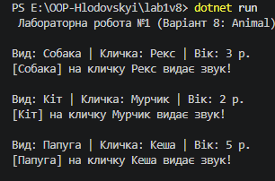

# Лабораторна робота №1. Створення класів та об'єктів у C#
**Дисципліна:** Об'єктно-орієнтоване програмування  
**Студент:** Глодовський Богдан 
**Варіант:** №8 (`Animal`)  

---

## Мета роботи
Ознайомитися з основами об'єктно-орієнтованого програмування на мові C#. Набути практичних навичок створення класів, оголошення приватних полів, публічних властивостей, конструкторів та методів, а також налаштування системи контролю версій Git і завантаження проєкту на GitHub.

---
## Хід роботи
В процесі виконання роботи я ознайомився з основами об'єктно-орієнтованого програмування на мові C#. Та набув практичних навичок в роботі з ними.

## Результат виконання
   

---

## Висновки
Під час виконання лабораторної роботи я засвоїв базові принципи ООП (створення класів, об'єктів, застосування інкапсуляції за допомогою властивостей), навчився працювати з .NET CLI у командному рядку та закріпив навички роботи з Git і GitHub.