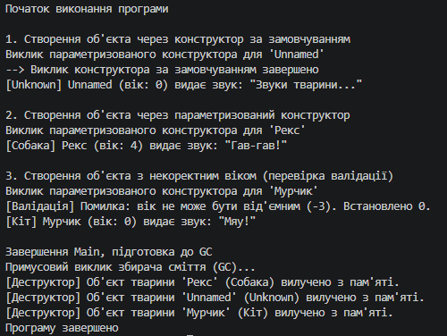

# Звіт з лабораторної роботи №2

* **Тема:** Клас із кількома конструкторами. Життєвий цикл об’єкта.
* **Мета:** Навчитися реалізовувати перевантажені конструктори, дослідити порядок їх викликів та зрозуміти основи життєвого циклу об’єкта в C#.
* **Варіант:** №8 

---
## Хід роботи
У межах роботи було реалізовано клас Animal із приватними полями, валідацією властивостей (зокрема перевіркою від'ємного віку), перевантаженими ланцюговими конструкторами (: this()), методом Speak() та деструктором ~Animal(), а в методі Main() повністю продемонстровано життєвий цикл об'єктів через створення трьох екземплярів різними шляхами, перевірку валідації та примусовий виклик збирача сміття (GC.Collect()) для їхньої фіналізації.

## Результат виконання

---

## Висновок: 
Життєвий цикл об’єкта в C# охоплює його виділення в купі (heap) та ініціалізацію конструктором (використання ланцюгового виклику : this() дозволяє оптимізувати код і уникнути дублювання), період активного використання за наявності посилань, а також автоматичне вилучення збирачем сміття (Garbage Collector) із виконанням деструктора ~Animal() після того, як об'єкт стає недосяжним.