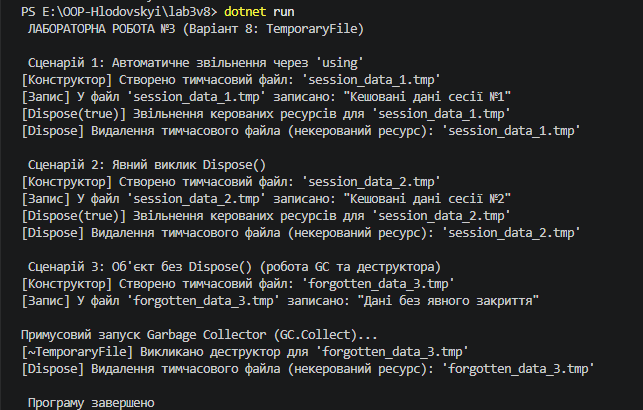

# Звіт з лабораторної роботи №3

* **Тема:** Життєвий цикл об’єкта та керування ресурсами.
* **Мета:** Поглибити розуміння життєвого циклу об’єкта в C#, навчитися керувати некерованими ресурсами та правильно реалізувати інтерфейс IDisposable і патерн Dispose на прикладі класу TemporaryFile.
* **Варіант:** №8 (Клас `TemporaryFile`)

---

## 1. Код класу `TemporaryFile` 
public class TemporaryFile : IDisposable
    {
        // 1. Поля
        private bool _disposed = false;
        private bool _fileExists;         
        private readonly string _tempFilePath;

        // 2. Властивості
        public string TempFilePath => _tempFilePath;
        public bool FileExists => _fileExists;

        // 3. Конструктор (виділення ресурсу)
        public TemporaryFile(string filePath)
        {
            _tempFilePath = filePath;
            _fileExists = true;
            Console.WriteLine($"[Конструктор] Створено тимчасовий файл: '{_tempFilePath}'");
        }

        // 4. Метод класу
        public void Write(string content)
        {
            if (_disposed || !_fileExists)
            {
                throw new ObjectDisposedException(nameof(TemporaryFile), "Помилка: тимчасовий файл уже видалено!");
            }

            Console.WriteLine($"[Запис] У файл '{_tempFilePath}' записано: \"{content}\"");
        }

        // 5. Захищений віртуальний метод Dispose(bool disposing) — Патерн Dispose
        protected virtual void Dispose(bool disposing)
        {
            if (!_disposed)
            {
                if (disposing)
                {
                    Console.WriteLine($"[Dispose(true)] Звільнення керованих ресурсів для '{_tempFilePath}'");
                }

                if (_fileExists)
                {
                    Console.WriteLine($"[Dispose] Видалення тимчасового файла (некерований ресурс): '{_tempFilePath}'");
                    _fileExists = false;
                }

                _disposed = true;
            }
        }

        // 6. Публічний метод Dispose()
        public void Dispose()
        {
            Dispose(true);
            GC.SuppressFinalize(this);
        }

        // 7. Деструктор (Фіналізатор)
        ~TemporaryFile()
        {
            Console.WriteLine($"[~TemporaryFile] Викликано деструктор для '{_tempFilePath}'");
            Dispose(false);
        }
    }

## 2. Результат виконання

## Висновок: 
Використання оператора using або явного виклику Dispose() (Сценарії 1 і 2) забезпечує миттєве звільнення некерованих ресурсів одразу після використання. У той же час Сценарій 3 підтверджує, що реалізація деструктора з Dispose(false) виступає страховкою: якщо розробник забув закрити ресурс, GC виконає фіналізацію і закриє файл, проте момент цього виклику є недетермінованим і навантажує продуктивність програми.