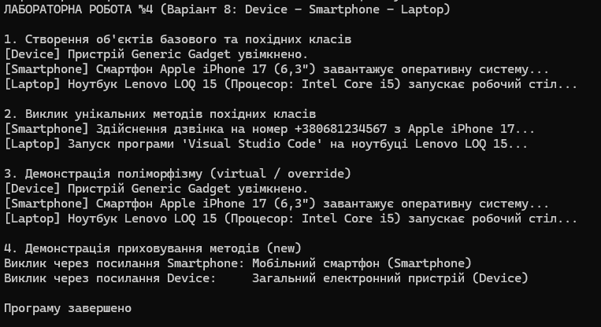

# Звіт з лабораторної роботи №4

* **Тема:** Наслідування. Ключові слова base, override, virtual. Приховування членів (new).
* **Мета:** Навчитися створювати ієрархії класів, використовувати ключові слова base, virtual, override для реалізації поліморфізму, а також розуміти відмінності між override та приховуванням членів за допомогою new. 
* **Варіант:** №8 

---
## Хід роботи
У межах роботи було реалізовано ієрархію класів Device -> Smartphone -> Laptop. Реалізовано виклик конструкторів базового класу через base(...), перевизначення віртуального методу PowerOn() за допомогою override, унікальні методи класів, а також приховування методу GetDeviceType() за допомогою new. У Main() продемонстровано поліморфізм та різницю між override і new.
## Результат виконання

---

## Висновок: 
Наслідування та конструктор base(...) дозволяють ефективно повторно використовувати код у похідних класах. Зв'язка virtual/override забезпечує динамічний поліморфізм залежно від фактичного типу об'єкта, у той час як new лише приховує метод базового класу без зміни поліморфної поведінки.