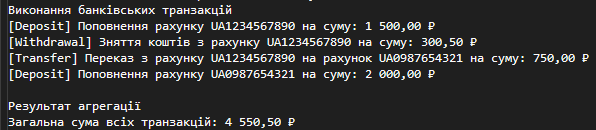

# Звіт з лабораторної роботи №5

* **Тема:** Поліморфізм: динамічне зв’язування та перевизначення методів.
* **Мета:** Навчитися реалізовувати поліморфну поведінку за допомогою віртуальних методів та їх перевизначення, а також агрегувати результати поліморфних викликів. 
* **Варіант:** №8 

---
## Хід роботи
У межах роботи було реалізовано ієрархію класів для банківських операцій Transaction -> Deposit, Withdrawal, Transfer (Варіант 8). Базовий клас Transaction містить віртуальний метод Execute(), який перевизначається (override) у похідних класах для виконання специфічної логіки кожної операції. Всі класи реалізують конструктори з викликом base(...). У методі Main() створено колекцію List<Transaction>, продемонстровано поліморфний виклик методу Execute() та виконано агрегацію (обчислено загальну суму всіх транзакцій).
## Результат виконання

---

## Висновок: 
Динамічне зв'язування та використання virtual/override дозволяють викликати конкретну реалізацію методу залежно від фактичного типу об'єкта під час виконання програми. Використання колекції базового типу List<Transaction> забезпечує гнучкість та розширюваність коду, дозволяючи обробляти різні типи транзакцій і виконувати їх агрегацію в єдиному циклі.