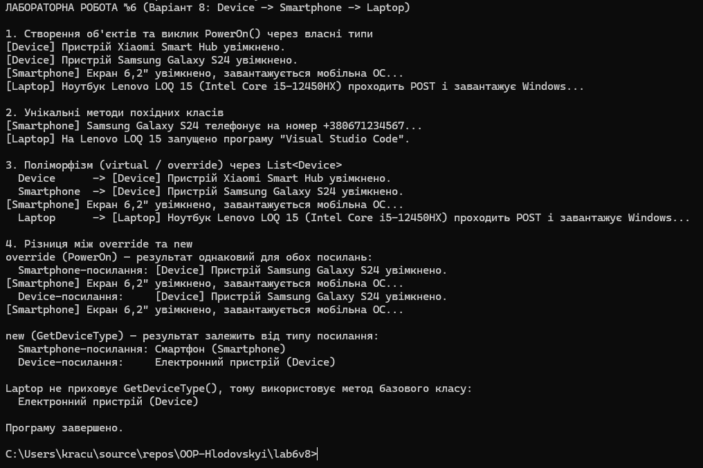

# Звіт з лабораторної роботи №6

* **Тема:** Наслідування. Ключові слова base, override, virtual. Приховування членів (new).
* **Мета:** Навчитися створювати ієрархії класів, використовувати ключові слова base, virtual, override для реалізації поліморфізму, а також розуміти відмінності між override та приховуванням членів за допомогою new.
* **Варіант:** №8
* **Репозиторій:** https://github.com/vomprix52/OOP-Hlodovskyi/tree/main/lab6v8

---
## Хід роботи
У межах роботи реалізовано ієрархію класів Device -> Smartphone -> Laptop.

* **Device** (базовий клас) — приватні поля `_brand`, `_model` та публічні властивості `Brand`, `Model` з перевіркою значень, конструктор, віртуальний метод `PowerOn()` і звичайний метод `GetDeviceType()`.
* **Smartphone** (похідний клас) — властивість `ScreenSize`, конструктор з викликом `base(brand, model)`, перевизначений `PowerOn()` (усередині викликає `base.PowerOn()`), унікальний метод `MakeCall()` та метод `GetDeviceType()`, прихований за допомогою `new`.
* **Laptop** (похідний клас) — властивість `Processor`, конструктор з викликом `base(brand, model)`, перевизначений `PowerOn()` та унікальний метод `RunProgram()`.

У `Main()` створено об'єкти всіх класів, викликано їхні унікальні методи, продемонстровано поліморфізм через `List<Device>` та різницю між `override` і `new` при виклику через посилання типу `Smartphone` і `Device` на той самий об'єкт.

## Результат виконання

---

## Висновок:
Наслідування та виклик конструктора через base(...) дозволяють повторно використовувати код базового класу. Пара virtual/override забезпечує поліморфізм: метод обирається за фактичним типом об'єкта. Модифікатор new лише приховує метод базового класу, тому результат залежить від типу посилання.